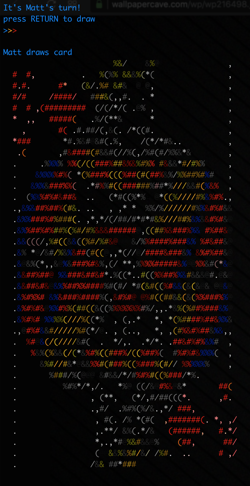

## About

Welcome!  For this project, I used the object-oriented approach.  The project structure looks like:

	.
	├── lib
	│   ├── classes.py  -->  Card, Deck, and Player classes
	│   ├── config.py  -->  global variables
	│   ├── decorate.py
	│   ├── game.py  -->  controls game flow (look at this file first)
	│   ├── utils.py
	│   └── validate.py  -->  error messages and input validation
	└── main.py  -->  kicks off the entire program

There is also a `data` folder that stores images and their corresponding generated ascii image strings.  The scripts `crop.py` and `html_to_pystring.py` automate part of the image generation.  The generate ascii image strings are checked into the repository, so there is no need to rebuild them, but feel free to look at the scripts if you so please.

## Installation

The dependencies are

  * **[Python 3.7](https://www.python.org/downloads/release/python-372/)**  (sty requires python 3.5 or above)
  * [sty](https://github.com/feluxe/sty)  (used to color text and ascii images in the terminal)
  * [colorama](https://pypi.org/project/colorama/#files)  (used to extend color support to Windows)
  * [iTerm2](https://www.iterm2.com)  (this is *not* a dependency, but if you have issues with color support, I would recommend trying the program in this terminal)

Once you have python 3 installed, you should be able to install sty and colorama into your python 3 library with, for example,

	cd card-game-matthew-lancellotti
    python3 $(which pip) install -r requirements.txt

## Usage

Simply run the `main.py` script.  For example:

    cd card-game-matthew-lancellotti
    ./main.py

